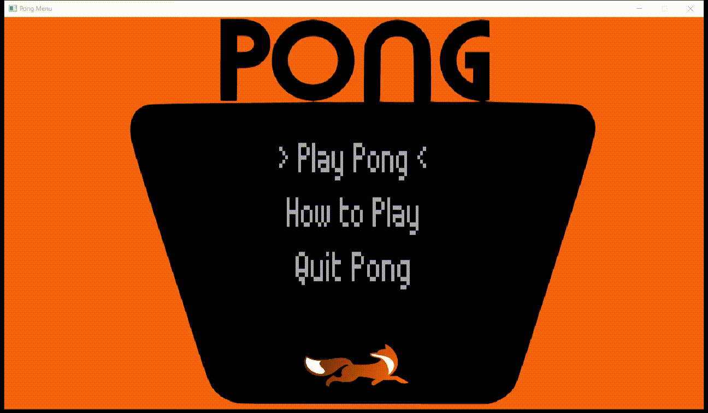

# Pong Game

---

---

### Download
| Latest release | Latest development build |
|----------------|--------------------------|
| (Enlace a la version actual) | (Enlace a la version en desarrollo) |

 <a href="https://drive.google.com/drive/folders/1nUhdGTyS4dusktz63wyBe_o-gAqhHEyF?usp=sharing">Download</a>
 
---

# Contents
- 1 - [Introduction](#1-introduction)
- 2 - [Downloading the application](#2-downloading-the-game-pre-built)
- 3 - [Building the game](#3-building-the-game)
  - 3.1 - [Building prerequisites](#31-building-prerequisites)
  - 3.2 - [Compiling and running](#32-compiling-and-running)
- 4 - [Contributing](#4-contributing)
- 5 - [Licence](#5-licence)

---

# 1. Introduction

Pong Game developed with SDL2 library and C++.

---

# 2. Downloading the application

---

# 3. Building the application

## 3.1 Building prerequisites

---

## 3.2 Compiling and running

---

# 4. Contributing

---
# 5. Licence
